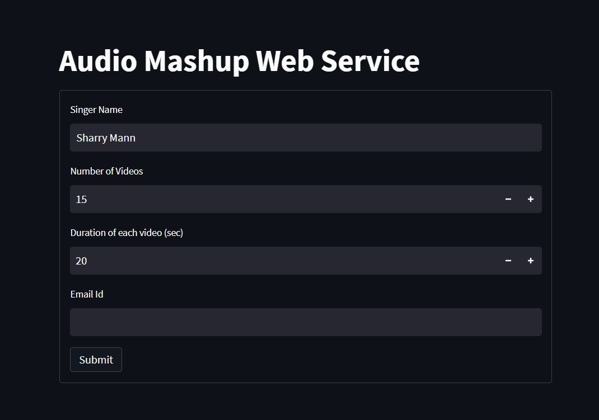

# Audio Mashup Creator


[](https://opensource.org/licenses/MIT)
[](https://www.python.org/downloads/release/python-3100/)


> 
> A robust Python utility to generate automated audio mashups by downloading, processing, and merging songs from YouTube. Includes a CLI for batch processing and a Streamlit Web App for user interaction.
> 
> 
> 


## 📝 Description


Creating a custom music mashup usually requires manual downloading and editing, which is time-consuming. This project automates the entire pipeline.


The tool accepts a **Singer's Name**, downloads `N` random videos of that artist from YouTube, trims the first `Y` seconds of audio from each video, and merges them into a single continuous MP3 file. It is designed to bypass modern YouTube restrictions (SABR/DRM) using advanced `yt-dlp` configurations.


## 🛠 Methodology


1. **Content Extraction:** Used **yt-dlp** with custom `extractor_args` to bypass region locks and "403 Forbidden" errors by simulating a Safari/Embedded browser client.
2. **Audio Processing:**
	* **Extraction:** FFmpeg is used to rip high-quality audio directly from video streams.
	* **Manipulation:** **Pydub** handles the trimming (first Y seconds) and concatenation of audio segments.
3. **User Interface:** Built a **Streamlit** web app that accepts user inputs and uses **SMTP** to email the final zipped mashup file to the user.
4. **Deployment:** The logic is encapsulated in a CLI script for local use and a web service for cloud deployment.


## 📥 Input / Output


### User Parameters


The program accepts the following inputs from the user:


| Parameter | Description | Constraint |
| --- | --- | --- |
| **Singer Name** | The artist to search for on YouTube | String |
| **Number of Videos (N)** | Total videos to extract audio from | Integer (> 10) |
| **Duration (Y)** | Seconds to trim from the start of each video | Integer (> 20) |
| **Output File** | Name of the final mashup file | .mp3 |


### Execution Example


An example of how the tool processes a request for "Sharry Mann":


| Input Command | Process | Final Output |
| --- | --- | --- |
| `python 102303998.py "Sharry Mann" 20 20 mashup.mp3` | 1. Search "Sharry Mann"<br>2. Download 20 videos<br>3. Trim 0-20s of each<br>4. Merge clips | **mashup.mp3**<br>(Total Length: ~400s) |


## 📸 Screenshot


[


## 🚀 Usage


1. **Clone the repository:**

```bash
git clone [https://github.com/nishthxaaa/Mashup-Assignment.git](https://github.com/nishthxaaa/Mashup-Assignment.git)
cd Mashup-Assignment
```

2. **Install dependencies:**

   ```bash
   pip install -r requirements.txt
   ```
3. Run the program

### Method 1: Command Line Interface (CLI)

Run the script directly from the terminal.

**Syntax:**

```bash
python <Program_File>.py <SingerName> <NumberOfVideos> <Duration> <OutputFileName>
```

**Example:**

```bash
python 102303998.py "Sharry Mann" 20 20 mashup.mp3
```

### Method 2: Web Application

Launch the graphical interface using Streamlit.

```bash
streamlit run app.py
```
